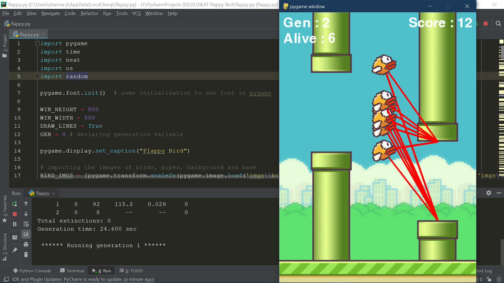
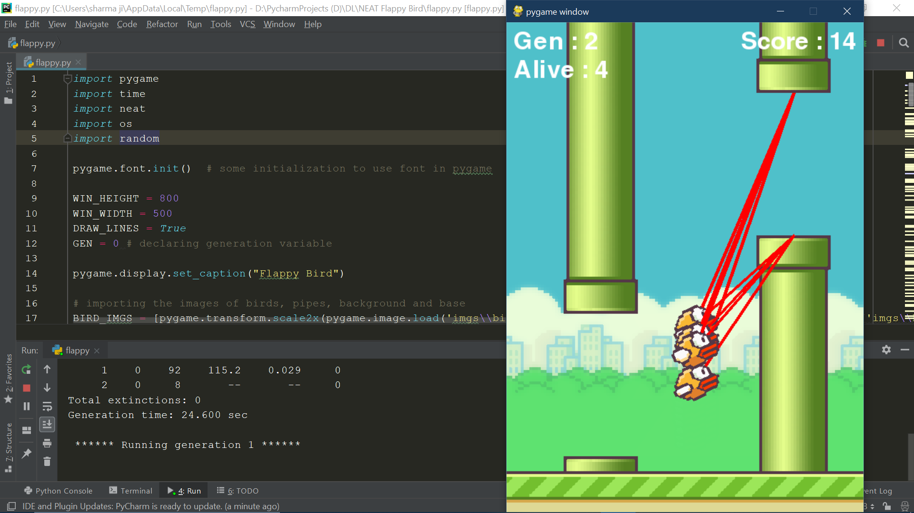
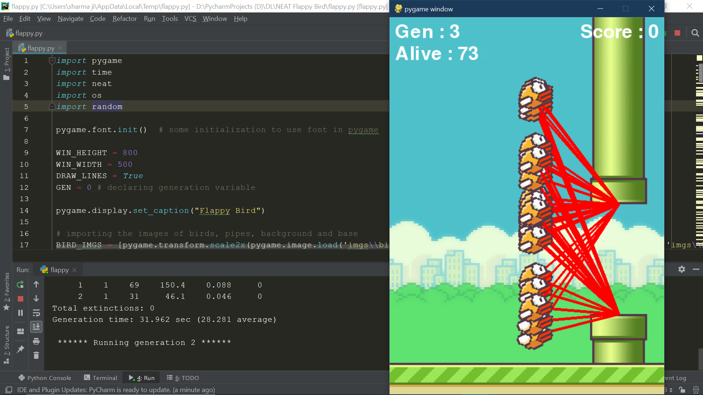

# NEAT Flappy Bird
In this project I have made a flappy bird game which is being played by an AI using NEAT(NeuroEvolution of Augmenting Topologies) module of python.

The first generation is just a bunch of some random neural networks and successuive generations are made by the breeding of the best birds of previous generation.

You can change the configurations according to you in the configuration file but that's not advisable as these are the best settings that I came through.

Just see the requirements file and check if these modules are present in your pc or not.

And just run the flappy.py and see the magic happen.

if you dont want to see the red lines then you can set DRAW_LINES=False in the starting of the program.

